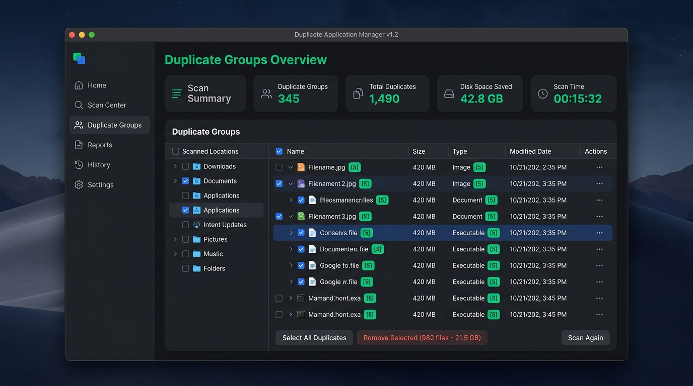
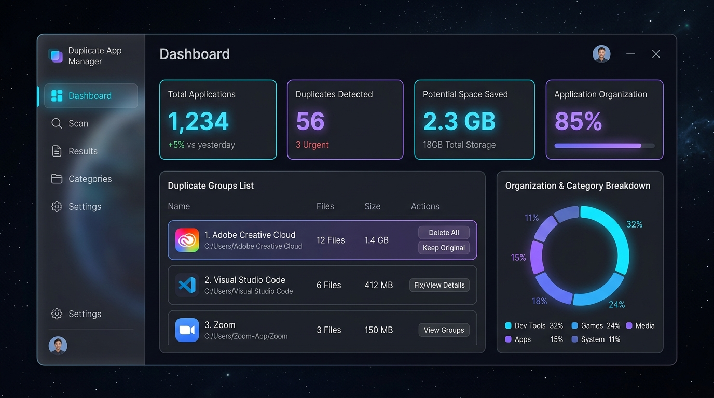
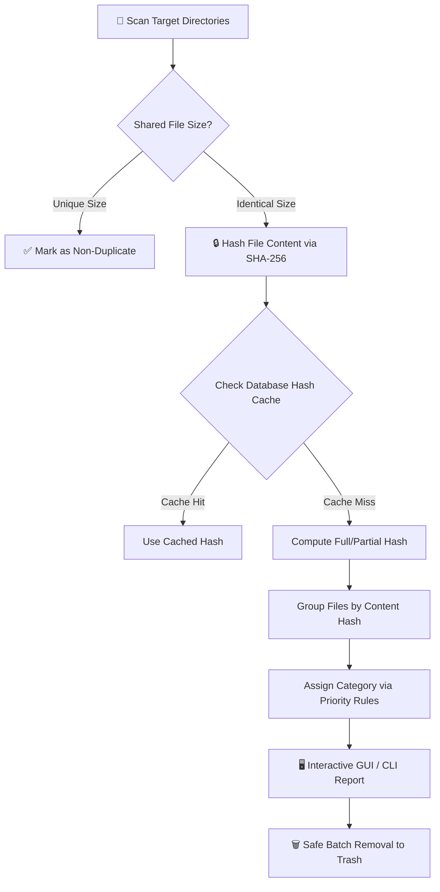

<div align="center">

# ⬡ Duplicate Application Manager

**Next-Gen Content-Based Duplicate Application & Executable Manager for Desktop & CLI**

[](https://www.python.org/)
[](https://www.qt.io/)
[](https://www.sqlite.org/)
[](LICENSE)
[]()

---

### 🚀 Reclaim Storage Space by Identifying & Cleaning Duplicate Binaries

*Unlike traditional duplicate finders that rely on filenames, **Duplicate Application Manager** analyzes the actual binary byte stream using **SHA-256 cryptographic hashing** to find byte-for-byte identical applications.*

<br/>



</div>

---

## ✨ Key Features

| Feature | Description |
| :--- | :--- |
| 🛡️ **Cryptographic SHA-256 Hashing** | Identifies duplicate applications by raw binary content, ignoring renamed files or different folder paths. |
| ⚡ **Partial Hashing for Large Files** | Automatically uses header/footer chunk hashing for files $> 100\text{ MB}$ to process multi-gigabyte binaries in seconds. |
| 🎨 **Nordic Studio Dark GUI** | Modern glassmorphic PySide6 desktop interface with dark obsidian surfaces, mint emerald accents, and responsive layout. |
| 🗑️ **Safe Recycle Bin Removal** | Integrates system trash (`send2trash`) so files can be safely restored if needed—never hard-deleting without safety. |
| 📁 **Rule-Based Categorization** | Priority rule engine automatically categorizes applications into *Development Tools*, *Games*, *Productivity*, *Utilities*, and *Media*. |
| 💻 **Headless CLI & Automation** | Complete command-line support (`--headless`, `--scan`, `--report`) for automated server cron jobs and CI script workflows. |
| 📊 **Reporting & Audit Logging** | Generates detailed summary reports in **JSON** and **Text** formats, with continuous logging to `logs/app_manager.log`. |

---

## 📸 Product Interface Gallery

<div align="center">

| Dashboard Overview | Cyber Dark Aesthetics |
| :---: | :---: |
|  |  |
| *Real-time statistics & category distribution* | *High-contrast obsidian theme with glowing metrics* |

</div>

---

## ⚡ How It Works (Pipeline Architecture)



---

## 🛠️ Installation & Setup

### Prerequisites
- **Python 3.9+** installed on Windows, macOS, or Linux.
- **Git**

### 1. Clone the Repository
```bash
git clone https://github.com/Himanshu-Vishwakarma-GH/Duplicate-Application.git
cd Duplicate-Application
```

### 2. Create & Activate Virtual Environment
```bash
# Windows
python -m venv venv
.\venv\Scripts\activate

# macOS / Linux
python3 -m venv venv
source venv/bin/activate
```

### 3. Install Dependencies
```bash
pip install -r requirements.txt
```

---

## 🚀 Usage Guide

### 🖥️ Launch Desktop GUI Interface
Run the main script to open the PySide6 desktop application:
```bash
python main.py
```

- **Dashboard**: View total applications scanned, duplicate group counts, space savings, and category charts.
- **Scan Config**: Configure target directories, extension filters (`.exe, .msi, .app`), exclusions, and start scans.
- **Duplicate Results**: Search, filter, select duplicates (*"Keep First"*), and safely send them to trash.
- **Category Browser**: Browse applications by category and dynamically reassign software categories.

---

### 💻 Run Headless CLI Mode (Automation)
Run scans and export reports directly from the terminal without launching the GUI:

```bash
# Run headless scan on a target directory and export a JSON report
python main.py --headless --scan "C:\Program Files" --report "data/report.json"

# Run headless scan and export a plain text summary report
python main.py --headless --scan "D:\Applications" --report "data/report.txt"
```

---

## ⚙️ Configuration Management

Configuration settings and categorization rules are stored in clean JSON schemas:

- **`config/default_config.json`**:
  ```json
  {
    "scan_directories": ["C:\\Program Files"],
    "file_extensions": [".exe", ".msi", ".app", ".dmg", ".deb", ".rpm"],
    "excluded_directories": ["node_modules", ".git", "__pycache__"],
    "large_file_threshold_mb": 100
  }
  ```

- **`config/rules.json`**:
  Defines category rule priorities (`path_contains`, `extension`, `size_range`, `path_matches`).

---

## 🧪 Running Automated Tests

The codebase includes 28 unit and integration tests covering database CRUD, SHA-256 hashing, directory scanning, PySide6 GUI views, remover integration, and reporter exports.

Run the test suite:
```bash
python -m unittest discover tests -v
```

---

## 📜 Logging & Audit Trail

All scanning events, file hash caching, categorizations, and file removals are audited in real time to:
- **Console Standard Output**
- **Log File**: `logs/app_manager.log`

---

## 📄 License

Distributed under the **MIT License**. See `LICENSE` for details.

---

<div align="center">
  <sub>Built with ❤️ using Python 3 & PySide6 Qt. Star ⭐ this repository if you found it useful!</sub>
</div>
